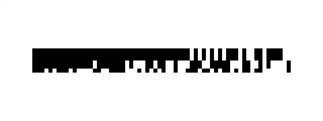

latency-clock
=============

Measure the latency of a video-output/video-capture combination.

`server` generates a video, drawing timestamps onto the video itself as 64-bit
nanoseconds binary in 8x8px black and white boxes.  It is intended to be run on
a Raspberry Pi, but should work anywhere.

There are six timestamps recorded.  The relevant one is the sixth.  This is the
time the frame will be displayed as 64-bit nanoseconds since the unix epoch
(realtime).

The output looks like:

`client` reads the timestamps back from the video and logs the latency to stderr
when run with `GST_DEBUG=timeoverlayparse:4`.  It is intended to be run on a
system that is capturing the video generated by the Raspberry Pi.

`client.py` is a separate implementation of the client in Python, using
[stb-tester](https://stb-tester.com).

For an example use-case see
<https://stb-tester.com/blog/2016/07/05/latency-measurements>.

LICENCE
-------

LGPLv2.1, the same as GStreamer that this is based on.
